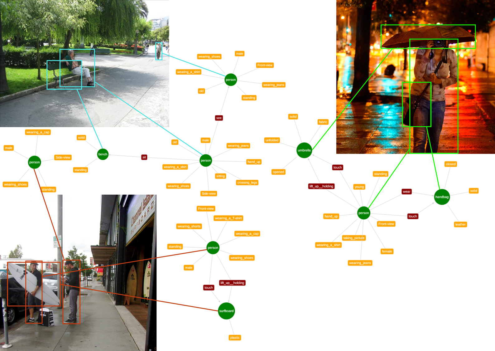

# KETI-SG
KETI Scene graph dataset은 50,000장의 이미지에 대해 장면그래프를 annotation한 데이터셋입니다.  
KETI-SG의 이미지들은 Imagenet(ILSVRC2012)과 Visual genome 데이터셋의 이미지 중 일부를 샘플링하여 구성하였습니다.  



# Install
1. Download [Imagenet](https://www.image-net.org) and [Visual genome](https://homes.cs.washington.edu/~ranjay/visualgenome/), then extract them into /source  
.  
├── source  
    ├── imagenet  
    │   ├── test  
    │   ├── train  
    │   └── val  
    └── visualgenome  
        ├── VG_100K  
        └── VG_100K_2  


2. Download [KETI-SG annotations](https://drive.google.com/file/d/1aWK8taUcZzvSLNv7XX5t34JsZxBefjp1/view?usp=drive_link), then extract them into /data
.  
├── data  
│   ├── meta_info  
│   ├── test  
│   │   ├── image  
│   │   ├── inpainting_samples  
│   │   │   ├── json_samples  
│   │   │   ├── mask  
│   │   │   └── masked_image  
│   │   ├── json  
│   │   └── segments  
│   ├── train  
│   │   ├── image  
│   │   ├── json  
│   │   └── segments  
│   └── val  
│       ├── image  
│       ├── inpainting_samples  
│       │   ├── json_samples  
│       │   ├── mask  
│       │   └── masked_image  
│       ├── json  
│       └── segments  

3. run gen_data.py for sampling raw images
```python 
python3 gen_data.py 
```
4. run gen_inpainting_samples.py for generating inpainting samples
```python
python3 gen_inpainting_samples.py 
```

# bibtex
KETI-SG를 이용하여 연구를 진행하실 경우 아래와 같이 인용해주시기를 부탁드립니다.

```
@misc{keti-sg,
    author       = {KETI AIRC},
    title        = {KETI-SG: KETI scene graph dataset},
    month        = dec,
    year         = 2023,
    url          = {https://github.com/AIRC-KETI/KETI-SG}
}
```


# Acknowledgement
* 본 연구는 2021년도 정부 (과학기술정보통신부)의 재원으로 정보통신기획평가원의 지원을 받아 수행된 연구임 (2021-0-00537, 자기지도 학습에 의한 시각적 상식으로 영상에서 보이지 않는 부분을 복원하는 기술)  
* This work was supported by Institute of Information and communications Technology Planning and evaluation (IITP) grant funded by the Korea government (MSIT) (2021-0-00537, Visual common sense through self-supervised learning for restoration of invisible parts in images)